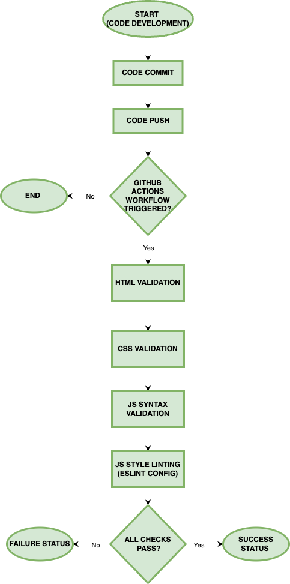

# CI Pipeline: Phase 1
## Progress
We have implemented the following:
- [X] HTML validation
- [X] CSS validation
- [X] JS syntax validation
- [X] JS styling linter (ESLint) 

The HTML and CSS validators act like the [Nu validators](https://github.com/validator/validator) used in Labs 2 and 3. The JavaScript linters and validators check for bad syntax or styling like inconsistent indentations, excluding semicolons, using `var`, loose equality, etc.

## Plans
For phase 2, depending on our progress, we're going to be looking at implementing the following:
- Unit Tests
- Automated documentation (JSDocs)

## Current Diagram
