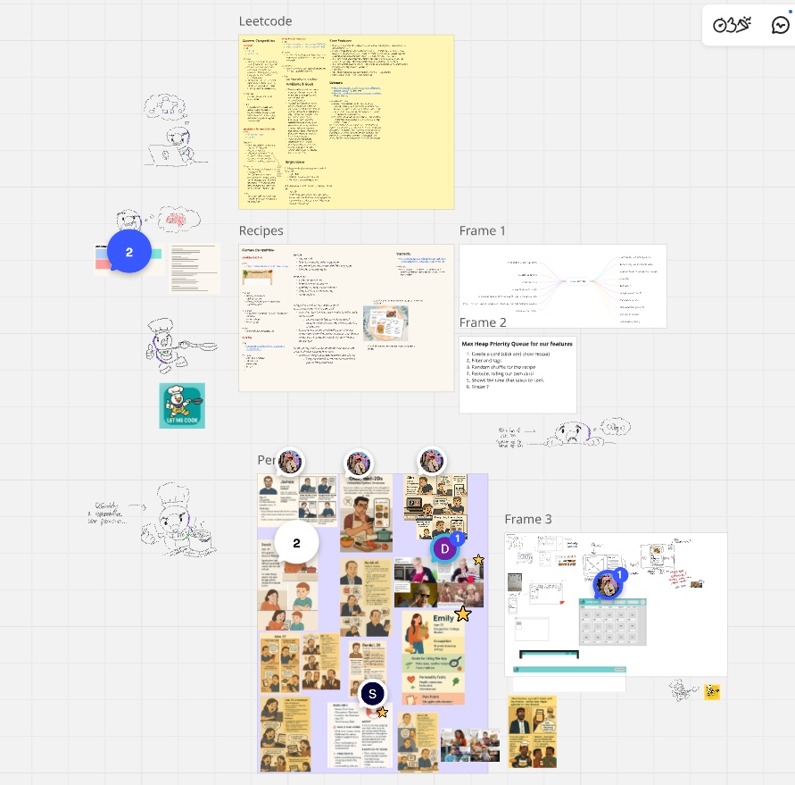
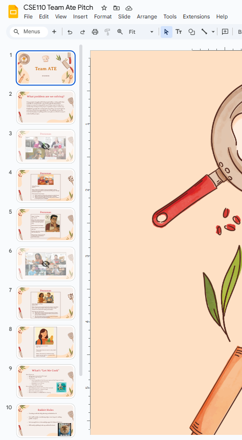

# Brainstorming Session #2
## Meeting Information
- **Meeting Date/Time:** April 26, 2025 @ 2:00 PM - 4:15 PM (2h 15m)
- **Meeting Purpose:** Finish brainstorming and work on the pitch
- **Meeting Location:** Online via Zoom
  
## Attendance
- [X] Arlene Garcia
- [X] Ashley Vo
- [X] Chanbin Na
- [X] Dorje Pradhan
- [X] Kiara Singh
- [X] Kiet Dang
- [X] Minahil Yasar
- [X] Patrick Thant
- [X] Ryan Awal
- [ ] Samson Gebrekidan
- [X] Shashwat Dudeja

## Brainstorming
### Tools
- Miro
- Google Slides

### Discussion
- Everything we discussed and wrote during the meeting was done via Miro and our Google Slides for the pitch. For access, see the team Slack.
- General overview of ideas we bounced around:
  - Narrowing down our personas
  - Features to include and exclude
  - Risks/Rabbit holes
  - Drafting and designing wireframes for our app

#### Miro

#### Google Slides

