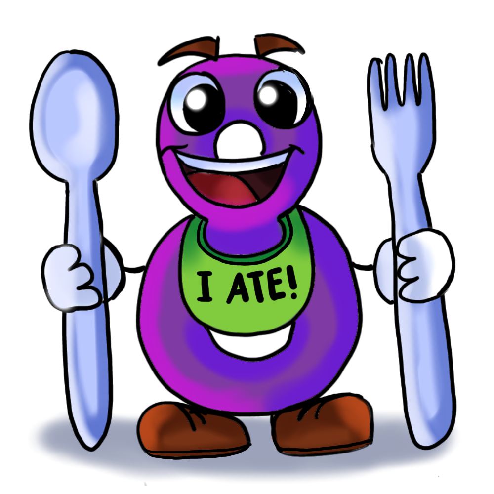

# Team Documentation

## 🎱 Team Name: Group ATE (8) 

### 🌟 Values:
- Respect - We value each team member's ideas, backgrounds, and contributions and treat each other with kindness and consideration.
- Communication - We believe in clear, honest, and timely communication to keep everyone on the same page.
- Accountability - We take ownership of our work and support each other in meeting our responsibilities.
- Growth Mindset - We embrace challenges as opportunities to learn and are open to feedback.

### 🎨 Branding:

Here is out mascot/logo:

---

## 👥 Meet our Team Members!

### Phyo Thant aka Patrick
Hello, I am a junior transfer student. A fun fact about me is that I have a 115-day streak in Duolingo :) [Here is the link to my personal GitHub page!](https://phyoth.github.io/CSE-110-lab1/)

### Arlene Garcia
Hi, I am a second-year CS student in Warren 🤟🏽 A fun fact about me is that I enjoy rollerskating 🛼
Here is a link to my personal [Github Page](https://arlenecse.github.io/arlene-github-user-page/)

###  Kiara Singh
Hi, I'm a second year computer science student from Hong Kong. A fun fact about me is I lived on a ship when I was younger! [Here is a link](https://kiarasinghh.github.io/CSE110-Lab1/) to my personal page :)

### Minahil Yasar
Hi, I'm a senior CS student in ERC. A fun fact about me is I can hold my breath for over 2 minutes! [Here is link to my Github page](https://minahilyasar.github.io/cse110/) 

### Ashley Vo
Hi! 👋 I'm a third year transfer student in Seventh. A fun fact about about me is that I started growing gray hairs when I was in middle school. [Here's a link to my GitHub page.](https://avo-ucsd.github.io/avo-page/) 😎

### Chanbin Na
Hi! I'm a senior Math-CS student in Seventh. A fun fact about me is that I like producing music and making beats 🎹 [Here's a link to my GitHub page.](https://chanbinna.github.io/Github-User-Page/)

### Ryan Awal
Hi! I'm a third year CS major at Sixth. A fun fact about me is that I have traveled to over 40 countries. [Here is a link to my Github Page](https://ryanawal12.github.io/Lab1CSE110/)

### Samson Gebrekidan  
Hi! I'm a senior Computer Engineering student at UCSD. A fun fact about me is that I love football ⚽ and I can name every World Cup winner by heart. [Here’s a link to my GitHub page](https://samat4e.github.io/) 😄

### Shashwat Dudeja
Hi! I'm a third year Math-CS student from Seventh college. A fun fact about me is that I love chess and I can play it blindfolded(using chess notation). [Here's a link to my GitHub page](https://github.com/shash31/CSE110Lab1)

### Dorjé Pradhan
Hi there! I am a junior who transfered here this past fall for CSE and I am in Revelle College. A fun fact about me is that I am a guitar palyer in a band called The Toads! 🎸
[Here is a link to my personal GitHub page](https://doorjay.github.io/Pages-Project/)

---

## 🕓 Meeting Info & Logistics
- **Weekly Meetings:** Wednesdays @ 4:00pm
- **Initial Meeting Locations:**
    - Sixth College RWAC 5th floor terrace 
    - CSE courtyard 

For each meeting we will have:
- One **discussion lead**
- One **note taker**

---
## 💼 Team Charter
### Absences
If you can't make a meeting, please update the team in Slack ahead of time.

### Assignment Duties
- We will try to divide up the workload as evenly as possible, depending on the situation
- If you're falling behind, communicate with the team early
- Don't hesitate to reach out to each other to check in or offere help
  
### Sprints
- We'll decide whether to run weekly or bi-weekly sprints as we go
- During each srpint, we'll do regular check-ins to share progress and next steps. 
